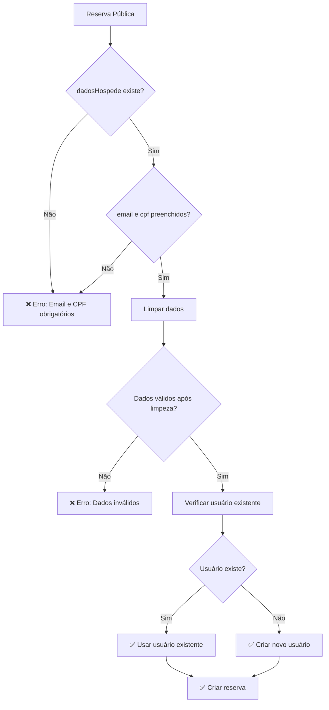

# Correção de Validação de Usuario - Grace Book

## Problema Identificado

O sistema estava apresentando erro de validação ao tentar criar reservas públicas:

```
Usuario validation failed: email: Path `email` is required., cpf: Path `cpf` is required.
```

### Causa Raiz

Os métodos `createPublico` e `createPublicoDebug` no `ReservasService` estavam tentando criar usuários com campos `email` e `cpf` vazios quando:

1. `dadosHospede` não estava presente no payload
2. `dadosHospede.email` ou `dadosHospede.cpf` eram strings vazias
3. Os campos eram `undefined` ou `null`

## Correções Implementadas

### 1. Validação Prévia nos Métodos de Reserva Pública

**Arquivo:** `src/modules/reservas/reservar.service.ts`

#### Método `createPublico`
```typescript
async createPublico(createReservaDto: CreateReservaDto): Promise<{ reserva: Reserva; pagamento: any }> {
  return this.executeWithTransaction(async (session) => {
    // ✅ Validar dados obrigatórios do hóspede
    if (!createReservaDto.dadosHospede?.email || !createReservaDto.dadosHospede?.cpf) {
      throw new BadRequestException(
        'Email e CPF são obrigatórios para criar uma reserva pública'
      );
    }

    // Criar usuário automaticamente com base nos dados do hóspede
    const usuario = await this.usuariosService.createFromBookingData({
      nome: createReservaDto.dadosHospede.nome || 'Usuário',
      sobrenome: createReservaDto.dadosHospede.sobrenome || '',
      email: createReservaDto.dadosHospede.email, // ✅ Sem fallback para string vazia
      cpf: createReservaDto.dadosHospede.cpf,     // ✅ Sem fallback para string vazia
      telefone: createReservaDto.dadosHospede.telefone || '',
      senha: this.generateRandomPassword(),
      isAdmin: false
    });

    return this.create(createReservaDto, (usuario as any)._id.toString());
  });
}
```

#### Método `createPublicoDebug`
```typescript
async createPublicoDebug(createReservaDto: CreateReservaDto): Promise<{ reserva: Reserva; pagamento: any }> {
  try {
    // ✅ Validar dados obrigatórios do hóspede
    if (!createReservaDto.dadosHospede?.email || !createReservaDto.dadosHospede?.cpf) {
      throw new BadRequestException(
        'Email e CPF são obrigatórios para criar uma reserva pública'
      );
    }
    
    // ... resto da implementação
  } catch (error) {
    this.logger.error(`Erro ao criar reserva pública DEBUG: ${error.message}`);
    throw error;
  }
}
```

### 2. Melhoria no Método `createFromBookingData`

**Arquivo:** `src/modules/usuarios/usuarios.service.ts`

```typescript
async createFromBookingData(bookingData: {
  nome: string;
  sobrenome: string;
  email: string;
  cpf: string;
  telefone: string;
  senha: string;
  isAdmin?: boolean;
}): Promise<Usuario> {
  // ✅ Validar dados obrigatórios
  if (!bookingData.email || !bookingData.cpf) {
    throw new BadRequestException(
      'Email e CPF são obrigatórios para criar um usuário'
    );
  }

  // ✅ Limpar e validar dados
  const emailLimpo = bookingData.email.trim();
  const cpfLimpo = bookingData.cpf.replace(/\D/g, ''); // Remove caracteres não numéricos

  if (!emailLimpo || !cpfLimpo) {
    throw new BadRequestException(
      'Email e CPF não podem estar vazios após limpeza'
    );
  }

  // Verificar se já existe usuário com o mesmo email ou CPF
  const usuarioExistente = await this.usuarioModel.findOne({
    $or: [
      { email: emailLimpo },
      { cpf: cpfLimpo }
    ],
  });

  if (usuarioExistente) {
    return usuarioExistente;
  }

  // ✅ Criar novo usuário com dados limpos
  const novoUsuario = new this.usuarioModel({
    nome: bookingData.nome?.trim() || 'Usuário',
    sobrenome: bookingData.sobrenome?.trim() || '',
    email: emailLimpo,
    cpf: cpfLimpo,
    telefone: bookingData.telefone?.trim() || '',
    senha: bookingData.senha,
    isAdmin: bookingData.isAdmin || false,
  });

  return novoUsuario.save();
}
```

## Melhorias Implementadas

### 1. **Validação Prévia**
- Verifica se `dadosHospede.email` e `dadosHospede.cpf` existem antes de tentar criar o usuário
- Retorna erro claro e específico quando dados obrigatórios estão ausentes

### 2. **Limpeza de Dados**
- Remove espaços em branco do email
- Remove caracteres não numéricos do CPF
- Valida se os dados não ficaram vazios após a limpeza

### 3. **Tratamento de Erros**
- Mensagens de erro específicas e informativas
- Logs detalhados para debugging
- Validação em múltiplas camadas

### 4. **Reutilização de Usuários**
- Verifica se já existe usuário com mesmo email ou CPF
- Retorna usuário existente ao invés de criar duplicata

## Fluxo de Validação



## Testes Recomendados

### 1. **Teste com Dados Válidos**
```json
{
  "dadosHospede": {
    "nome": "João",
    "sobrenome": "Silva",
    "email": "joao@email.com",
    "cpf": "123.456.789-00",
    "telefone": "(11) 99999-9999"
  },
  "tipo": "DIARIA",
  "dataInicio": "2025-01-01",
  "quantidadePessoas": 2
}
```

### 2. **Teste com Email Vazio**
```json
{
  "dadosHospede": {
    "nome": "João",
    "email": "",
    "cpf": "12345678900"
  }
}
```
**Resultado esperado:** `400 Bad Request - Email e CPF são obrigatórios`

### 3. **Teste com CPF Vazio**
```json
{
  "dadosHospede": {
    "nome": "João",
    "email": "joao@email.com",
    "cpf": ""
  }
}
```
**Resultado esperado:** `400 Bad Request - Email e CPF são obrigatórios`

### 4. **Teste com DadosHospede Ausente**
```json
{
  "tipo": "DIARIA",
  "dataInicio": "2025-01-01"
}
```
**Resultado esperado:** `400 Bad Request - Email e CPF são obrigatórios`

## Benefícios

✅ **Prevenção de Erros:** Validação prévia evita erros de schema
✅ **Dados Limpos:** CPF e email são normalizados antes do salvamento
✅ **Mensagens Claras:** Erros específicos ajudam no debugging
✅ **Reutilização:** Evita criação de usuários duplicados
✅ **Robustez:** Sistema mais resistente a dados malformados

## Próximos Passos

1. **Testar em ambiente de desenvolvimento** com diferentes cenários
2. **Implementar validação de formato** de email e CPF
3. **Adicionar logs de auditoria** para criação de usuários
4. **Considerar implementar** validação de CPF real (algoritmo de verificação)
